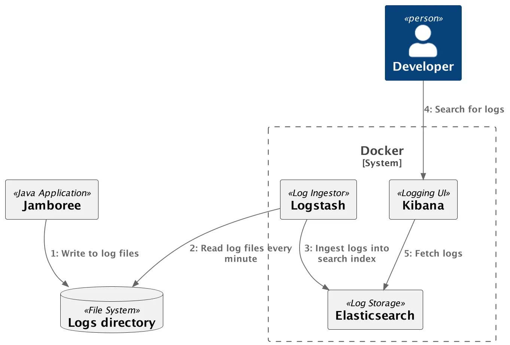
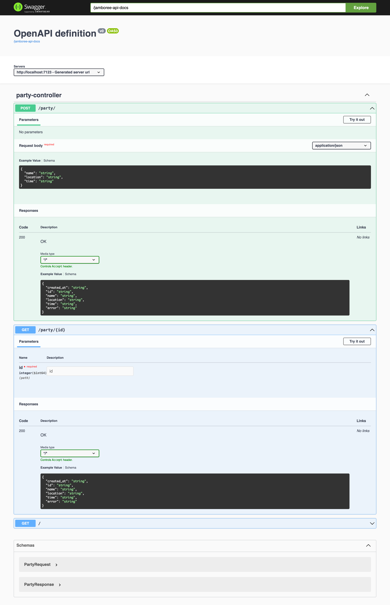
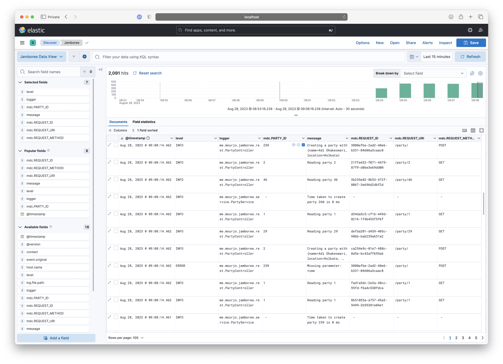
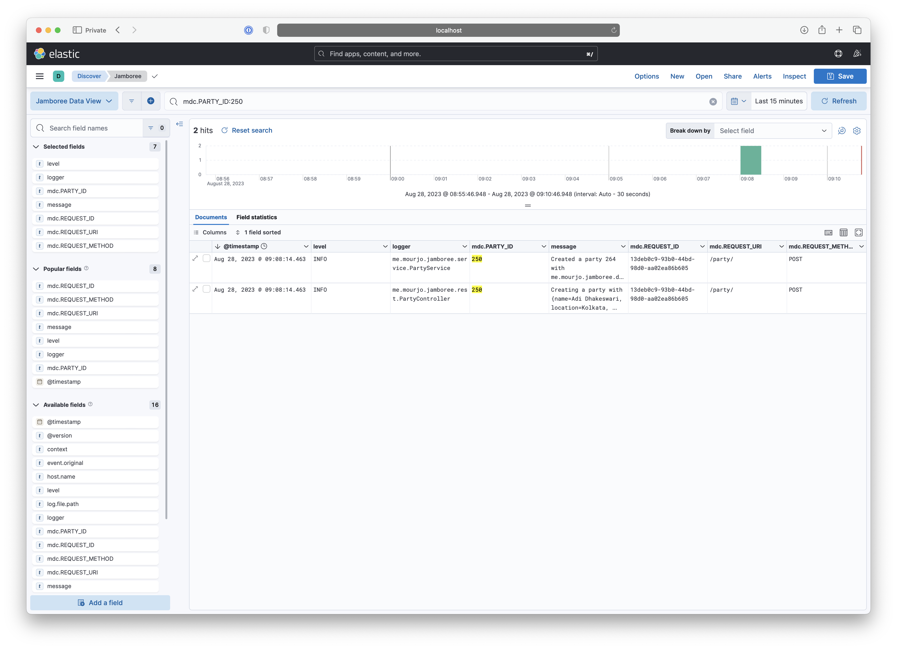
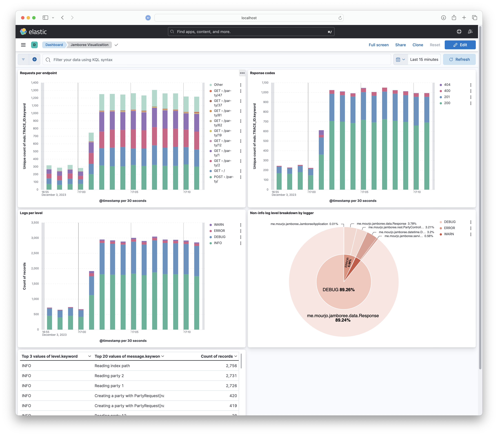
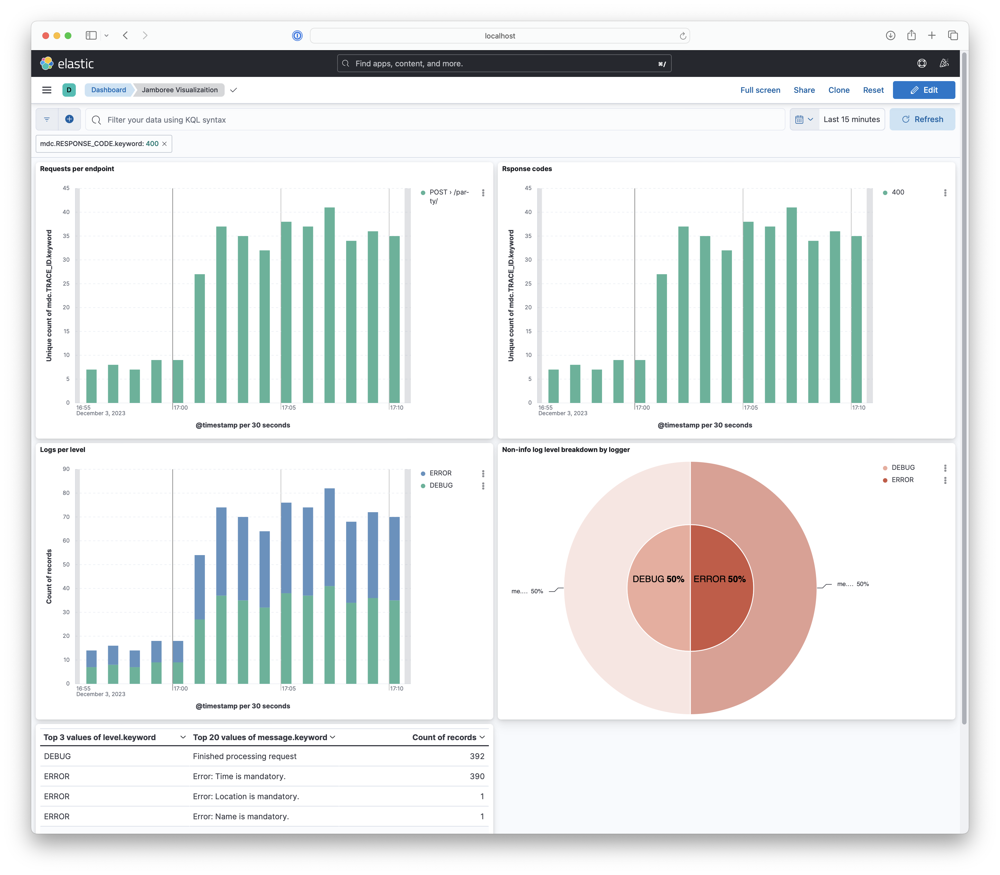

# jamboree: Structured Logging with Spring

This is a companion project to [this blog article](https://medium.com/booking-com-development/unlocking-observability-structured-logging-in-spring-boot-c81dbabfb9e7). 
The goal is to demonstrate structured logging in a Spring Boot application with the ELK stack.

## Infrastructure
We will use a common logging infrastructure setup with Elasticsearch, Logstash and Kibana (ELK stack)

- **Log storage**: This is the search index and storage location for our structured logs. For this demo, we are using Elasticsearch
- **Log ingestor**: Application logs are locally stored on files (or streamed to STDERR), these logs need to be aggregated and collected for storage in Elasticsearch. In a production setup, there will be multiple nodes from where logs need to be aggregated. In this demo, we only have one application instance producing these nodes, which are periodically fetched by Logstash.
- **Logging UI**: As logs get aggregated and stored, we need an user-interface to view and analyze the logs. We will use Kibana for this.




# Running the system


The infrastructure setup can be provisioned with docker compose
```shell
docker compose -f docker-compose.yml up
```


## Starting the application

Compile into a jar:

```bash 
mvn clean package spring-boot:repackage 
```

Run the jar on port 7123:

```
java -jar target/jamboree-0.0.1-SNAPSHOT.jar --server.port=7123
```

Or combine the steps and run it directly and start the server on a given 7123:

```bash 
mvn clean && mvn spring-boot:run -Dspring-boot.run.jvmArguments='-Dserver.port=7123'
```

## Using the endpoints

Create a party:

```bash
$ curl -s -H 'Content-Type: application/json' \
  -XPOST "http://localhost:7123/party/" \
  -d '{"name": "Immunity 2023", "location": "Bidhannagar", "time": "2023-11-27 23:30 Asia/Kolkata"}'\
  | jq . ;

{
  "time": "Mon, 27 Nov 2023 23:30:00 +0530",
  "id": "80",
  "created_at": "Mon, 28 Aug 2023 07:23:53 +0200",
  "name": "Immunity 2023",
  "location": "Bidhannagar"
}
```

Get a party:

```bash
$ curl -s http://localhost:7123/party/80 | jq .

{
  "time": "Mon, 27 Nov 2023 23:30:00 +0530",
  "id": "80",
  "created_at": "Mon, 28 Aug 2023 07:23:53 +0200",
  "name": "Immunity 2023",
  "location": "Bidhannagar"
}
```

Get a party that has not been created:

```bash
$ curl -s http://localhost:7123/party/404 | jq .
{
  "error": "Not found"
}
```
## Routes
There are two routes - to create a party and to retrieve a party: http://localhost:7123/swagger-ui/index.html



### Request firing utility

Start firing requests with the included script:
```bash
./scripts/requests.sh 7123
```

# Logs on Kibana
Open Kibana on the browser: http://localhost:5601/app/discover#/view/a8a646e0-3f5a-11ee-acc5-bf1ed6446365

What you see is a good example of structured logging - we see the different fields in the log message in the columns:


We can now drill down on one of the fields, here we are looking at all logs for the party 250:




# Visualization
Information from logs can be aggregated and viewed on a more macroscopic level as well:
http://localhost:5601/app/dashboards#/view/a6cc3db0-91c2-11ee-9cd4-0f499c097bfb

For the following dashboard shows requests per endpoint, response codes, logs per level (ERROR/INFO/etc):



Not only that, it allows drill down by segments as well - in the screenshot below we are looking only at 400 responses
and what might have caused it - which is clearly visible in the "top log messages" panel:


