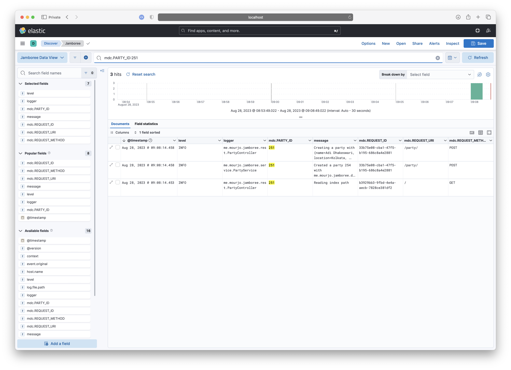
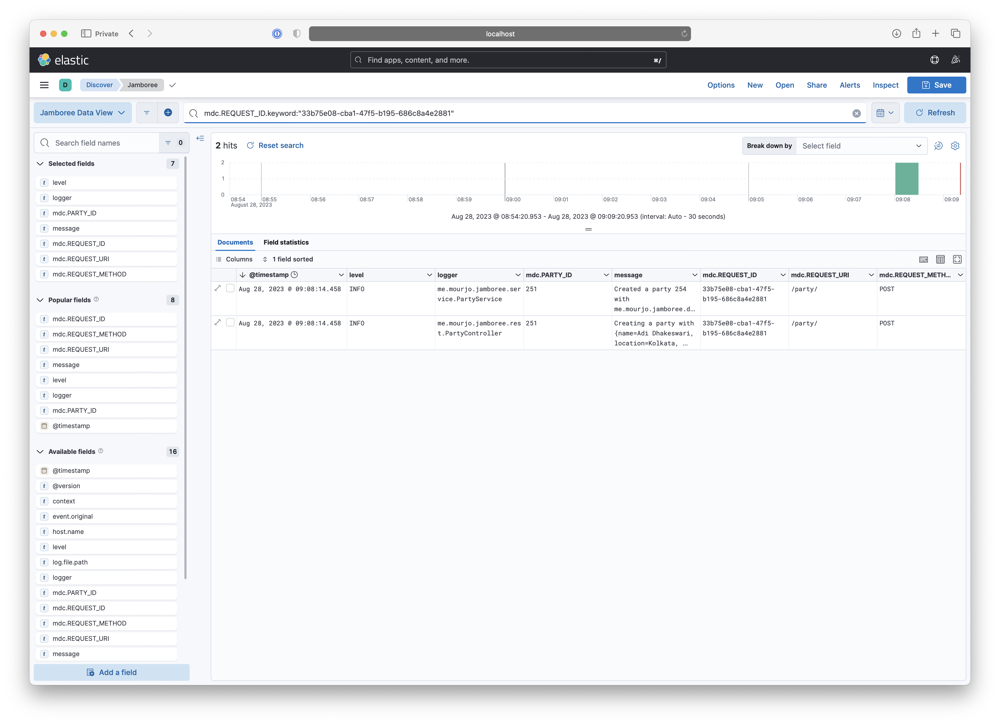

# jamboree

Structured Logging with Spring

## Start the application

Compile into a jar:

```bash 
mvn clean package spring-boot:repackage 
```

Run the jar on port 7123:

```
java -jar target/jamboree-0.0.1-SNAPSHOT.jar --server.port=7123
```

Or combine the steps and run it directly and start the server on a given 7123:

```bash 
mvn clean && mvn spring-boot:run -Dspring-boot.run.jvmArguments='-Dserver.port=7123'
```

## Using the endpoints

Create a party:

```bash
$ curl -s -H 'Content-Type: application/json' \
  -XPOST "http://localhost:7123/party/" \
  -d '{"name": "Immunity 2023", "location": "Bidhannagar", "time": "2023-11-27 23:30 Asia/Kolkata"}'\
  | jq . ;

{
  "time": "Mon, 27 Nov 2023 23:30:00 +0530",
  "id": "80",
  "created_at": "Mon, 28 Aug 2023 07:23:53 +0200",
  "name": "Immunity 2023",
  "location": "Bidhannagar"
}
```

Get a party:

```bash
$ curl -s http://localhost:7123/party/80 | jq .

{
  "time": "Mon, 27 Nov 2023 23:30:00 +0530",
  "id": "80",
  "created_at": "Mon, 28 Aug 2023 07:23:53 +0200",
  "name": "Immunity 2023",
  "location": "Bidhannagar"
}
```

Get a party that has not been created:

```bash
$ curl -s http://localhost:7123/party/404 | jq .
{
  "error": "Not found"
}
```
## Routes
There are two routes - to create a party and to retrieve a party: http://localhost:7123/swagger-ui/index.html


## Demo

### Setup
Start Kibana, Elasticsearch and Logstash:
```bash
docker compose up
```

Start firing requests with:
```bash
./scripts/requests.sh 7123
```

### Logs
Open Kibana on the browser: http://localhost:5601/app/discover#/view/a8a646e0-3f5a-11ee-acc5-bf1ed6446365

What you see is a good example of structured logging - we see the different fields in the log message in the columns:


We can now drill down on one of the fields, here we are looking at all logs for the party 250:


### Visualization
Information from logs can be aggregated and viewed on a more macroscopic level as well:
http://localhost:5601/app/dashboards#/view/a6cc3db0-91c2-11ee-9cd4-0f499c097bfb

For the following dashboard shows requests per endpoint, response codes, logs per level (ERROR/INFO/etc):


Not only that, it allows drill down by segments as well - in the screenshot below we are looking only at 400 responses
and what might have caused it - which is clearly visible in the "top log messages" panel:


### Thread local context
If MDC is not cleared up, we can get misleading logs - here we are querying for the entire history of the part 251 - but
we see that the latest log (topmost) seems to suggest that we are creating another party - but party 251 already exists.




Digging a bit deeper, if we now look only at the request ID from the previous request, we see two logs having the same
request ID. Since we are using UUIDs for request ID logging, this screenshot seems to suggest that we created two parties
in the same request.



But in reality, that is not so, what happens in the log at the bottom is that it is reusing a past request's context
which has not been properly cleaned up - so we see that although the request parameters did not have an ID, it still
logs an ID from the last request that the thread served.