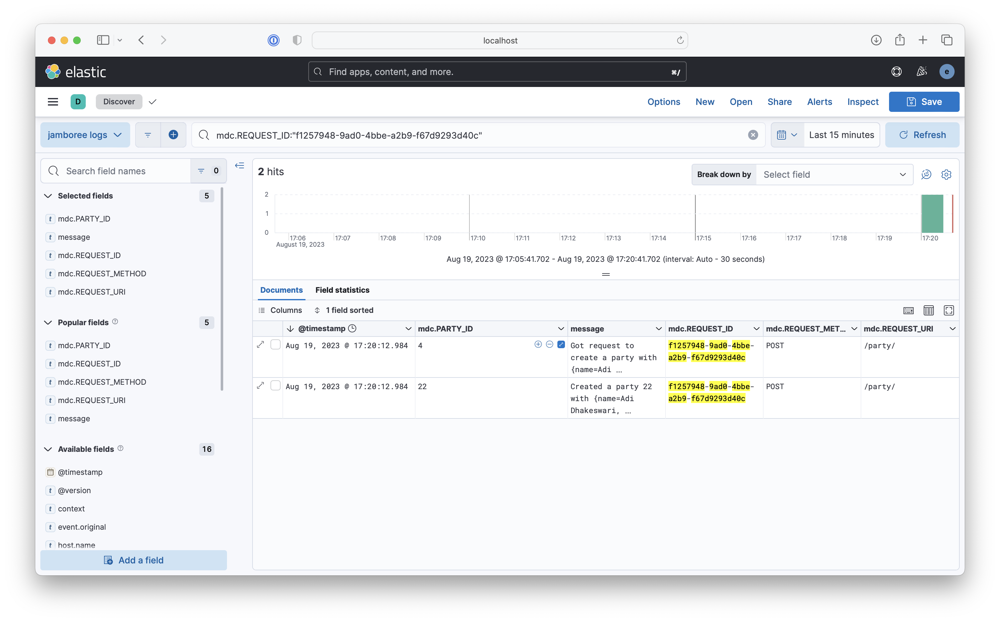

# jamboree

Structured Logging with Spring

## Start the application

Compile into a jar:

```bash 
mvn clean package spring-boot:repackage 
```

Run the jar on port 7123:

```
java -jar target/jamboree-0.0.1-SNAPSHOT.jar --server.port=7123
```

Or combine the steps and run it directly and start the server on a given 7123:

```bash 
mvn clean && mvn spring-boot:run -Dspring-boot.run.jvmArguments='-Dserver.port=7123'
```

## Using the endpoints

Create a party:

```bash
$ curl -s \
  -H 'Content-Type: application/json' \
  -XPOST http://localhost:7123/party/ \
  -d '{"name": "Traders Assembly", "location": "Gariahat"}' | jq .
{
  "created_at": "Sun, 13 Aug 2023 16:05:18 +0200",
  "location": "Gariahat",
  "name": "Traders Assembly",
  "id": "1"
}
```

Get a party:

```bash
$ curl -s http://localhost:7123/party/1 | jq .
{
  "created_at": "Sun, 13 Aug 2023 16:05:18 +0200",
  "location": "Gariahat",
  "name": "Traders Assembly",
  "id": "1"
}
```

Get a party that has not been created:

```bash
$ curl -s http://localhost:7123/party/2 | jq .
{
  "error": "Not found"
}
```

## Problem

### Setup
Start Kibana, Elasticsearch and Logstash:
```bash
docker compose up
```

Start firing requests with:
```bash
./scripts/requests.sh 7123
```

### Logs
Open Kibana on the browser: http://localhost:5601/app/discover#/view/a8a646e0-3f5a-11ee-acc5-bf1ed6446365


If MDC is not cleared up, we can get misleading logs - here we see that for the same request ID, there are
two party IDs

